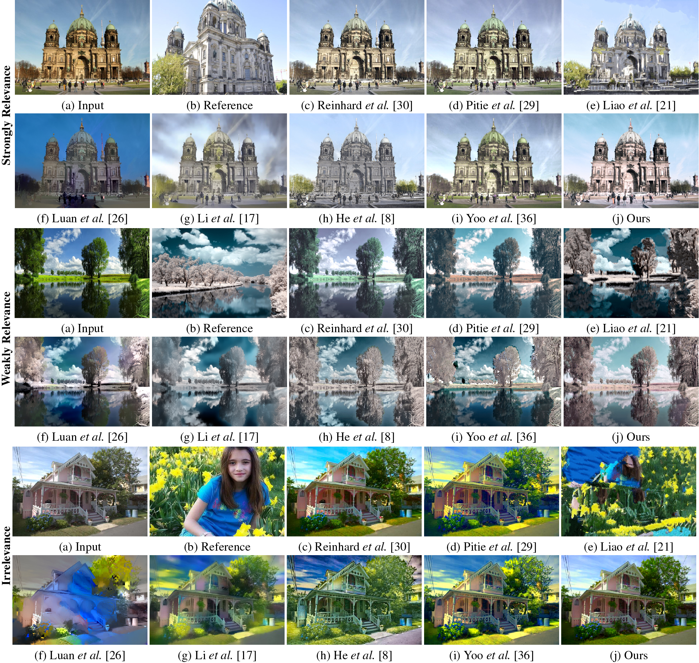

## Deep Color Transfer using Histogram Analogy<br><sub>Official PyTorch Implementation of the CGI 2020 Paper</sub><br><sub>[Project](https://junyonglee.me/projects/CTHA) | [Paper](https://link.springer.com/epdf/10.1007/s00371-020-01921-6?sharing_token=m2UzXwVlSCP8CbRYNrEcnve4RwlQNchNByi7wbcMAY5_mQV2iPdNT8_ORizvbX3p8mina4UHEjoKsvegf0S_FwC3Yo3cBRV6mlx1mdbvv3CiiREpz3ZqyJuRGmHbygkNL_7X-3hd2CMGSxgPtF22LPsyjpEfhG1R_bNHSSVNvbc%3D) | [Supp](https://www.dropbox.com/s/jxvg6ize41g43vj/Additional_Result.pdf?raw=1) | [Slide](https://www.dropbox.com/s/jbnp7omqre2pu9b/2020_junyonglee.pdf?raw=1)</sub>

This repo contains the evaluation code for the following paper:

> [**Deep Color Transfer using Histogram Analogy**](https://junyonglee.me/projects/CTHA)<br>
> [Junyong Lee](https://junyonglee.me)<sup>1</sup>, [Hyeongseok Son](https://sites.google.com/site/sonhspostech/)<sup>1</sup>, Gunhee Lee<sup>2</sup>, Jonghyeop Lee<sup>1</sup>, [Sunghyun Cho](https://www.scho.pe.kr/)<sup>1</sup>, and [Seungyong Lee](http://cg.postech.ac.kr/leesy/)<sup>1</sup><br>
> <sup>1</sup>POSTECH, <sup>2</sup>NCSOFT<br>
> *The Visual Computer (special issue on CGI 2020) 2020*<br>
> 

<p align="left">
  <a href="https://junyonglee.me/projects/CTHA">
    
  </a>
</p>
<p align="left">
  
</p>

**Figure:** *Color transfer results on various source and reference image pairs. For visualization, the reference image is cropped to make a same size with other images.*


## Getting Started
### Prerequisites
*Tested environment*


1. **Install requirements**
    * `pip install -r requirements.txt`

2. **Pre-trained models**
    * Download and unzip pretrained weights ([Google Drive](https://drive.google.com/open?id=1LgmziRPEDnbnQJTLvIVKLqA_TIPq6YHY&authuser=codeslake%40gmail.com&usp=drive_fs) | [Dropbox](https://www.dropbox.com/s/lkwo9xg168e650i/checkpoints.zip?dl=1) | [OneDrive](https://postechackr-my.sharepoint.com/:f:/g/personal/junyonglee_postech_ac_kr/EgfqG5rWeYxCvaXwYpcUcpcB1yS_PjLvsOOaJ9M5eNCsDQ?e=dXMhDf)) under `[CHECKPOINT_ROOT]`:

        ```
        ├── [CHECKPOINT_ROOT]
        │   ├── *.pth
        ```

        > **NOTE:**
        > 
        > `[CHECKPOINT_ROOT]` can be specified with the option `--checkpoints_dir`.


## Testing the network
* To test the network:

  ```bash
  python test.py --dataroot [test folder path] --checkpoints_dir [CHECKPOINT_ROOT]
  # e.g., python test.py --dataroot test --checkpoints_dir checkpoints
  ```

  > **Note:**
  >
  > * Input images and their segment maps should be placed under `./test/input` and `./test/seg_in`, respectively.
  > * Target images and their segment maps should be placed under `./test/target` and `./test/seg_tar`, respectively. 
  > * The test results will be saved under `./results/`.

* To turn on *semantic replacement*, add `--is_SR`:

  ```bash
  python test.py --dataroot [test folder path] --checkpoints_dir [ckpt path] --is_SR
  ```

## Contact
Open an issue for any inquiries.
You may also have contact with [junyonglee@postech.ac.kr](mailto:junyonglee@postech.ac.kr)

## Resources

All material related to our paper is available via the following links:

## License
<br>
This software is being made available under the terms in the [LICENSE](LICENSE) file.
Any exemptions to these terms require a license from the Pohang University of Science and Technology.

## Citation
If you find this code useful, please consider citing:
```
@Article{Lee2020CTHA,
    author  = {Junyong Lee and Hyeongseok Son and Gunhee Lee and Jonghyeop Lee and Sunghyun Cho and Seungyong Lee},
    title   = {Deep Color Transfer using Histogram Analogy},
    journal = {The Visual Computer},
    volume  = {36},
    number  = {10},
    pages   = {2129--2143},
    year    = {2020},
}
```

